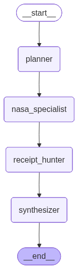

# ☄️ Cosmic Receipts [WIP]

**An Autonomous Agentic Orchestrator for Multi-Source Space & Literary Synthesis.**

`Cosmic Receipts` is a stateful AI agent built with **LangGraph** that bridges the gap between high-fidelity NASA technical data and cultural literary archives. By leveraging **Retrieval-Augmented Generation (RAG)** and **Vector Embeddings**, it identifies the "vibe" of specific space events by cross-referencing real-time telemetry with a localized semantic memory of 20th-century literature.

## Architecture & Flow
The system utilizes a **Directed Acyclic Graph (DAG)** to manage state transitions between specialized nodes. This ensures data integrity and allows for complex reasoning loops.

### System Flow

1.  **The Planner (LLM Orchestrator):** Deconstructs user queries into a multi-step execution plan, identifying technical search targets and cultural "vibe" parameters.
2.  **The NASA Specialist (Tool Layer):** Interacts with NASA REST APIs to fetch factual, time-stamped space data.
3.  **The Receipt Hunter (Semantic Memory):** Uses **ChromaDB** and `all-MiniLM-L6-v2` embeddings to perform a semantic similarity search, fetching "literary receipts" that match the technical context.
4.  **The Synthesizer (Persona Layer):** Merges disparate data streams into a unified, witty report.

## Technical Stack
* **Orchestration:** [LangGraph](https://github.com/langchain-ai/langgraph) (Stateful AI Workflows)
* **Vector Database:** [ChromaDB](https://www.trychroma.com/) (Local Semantic Storage)
* **Embeddings:** `sentence-transformers/all-MiniLM-L6-v2` (Local execution)
* **Data Sources:** [NASA API](https://api.nasa.gov/) (APOD, Image & Video Library)

## Key Engineering Features
* **Idempotent Memory Seeding:** The Vector DB initialization includes a collision-check to prevent duplicate data ingestion across multiple runs.
* **State Persistence:** Implemented `MemorySaver` checkpointer for thread-safe conversation history and multi-turn interaction.
* **Semantic RAG:** Moves beyond keyword matching to identify cultural context (e.g., matching the 1977 Voyager launch to the existential themes of *Lucifer's Hammer*).
